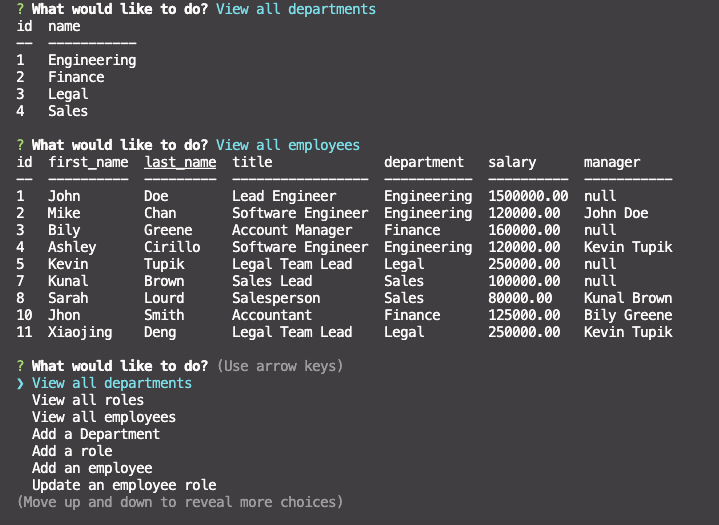

<h1>Employee Tracker Using MySQL, Inquirer, Console.Table and Node.js👋</h1>

## Badges

  

 

## Description
🔍 As a business owner, it would be helpful to be able to view and manage the departments, roles and employees. Employee Tracker is here to help you keep everything organized and updated. It is an all-in-one simple command prompt application.The walkthrough video file is created in the utils directory and can be found [here](utils/employee-tracker2.mp4).

https://user-images.githubusercontent.com/110792983/200735009-3289fc53-fda8-4560-8ab9-d1ab495af718.mp4

## Table of Contents
- [Description](#description)
- [Installation](#installation)
- [Usage](#usage)
- [Contributing](#contributing)
- [License](#license)
- [Questions](#questions)

## Installation
1. Copy Link: Hit the "Code" button within this GitHub repo to  copy link. 
2. Clone: Use the command "git clone paste link here". 
3. NPM: Run the command "npm install" to install Node Package  Manager and the following dependencies from the package.json file: 
-  inquirer 
-  MySQL2 
-  console.table 
4. MySql: 
In integrated terminal, use "mysql -u username -p"
Enter your MySQL password to login
Download database and tables to your remote workspace from the 'db' folder using commands: 
-  'source db/schema.sql' 
- 'source db/seeds.sql'
   

## usage
💻 After following installation instructions, navigate to your integrated terminal and begin the prompt using the command 'node app.js.'

From the main menu, select your desired option:

- View all departments,
- View all roles,
- View all employees,
- Add a Department,
- Add a role,
- Add an employee,
- Update an employee role,
- Update an employee manager,
- View employees by manager,
- View employees by department,  
- Delete a department,
- Delete a role,
- Delet an employee,
- View department budgets,
- Quit

Follow the prompts to add, update, or remove if chosen or simply select from the view list to access your tables.

Each selection, once completed, will bring you back to the main menu. To finish your session, simply select 'Quit'.

<video  width="500" height="400" controls>
  <source src="utils/employee-tracker2.mp4" type="video/mp4">
</video>

## Contributing
👥 Xiaojing Deng

## License

 

Permission to use this application is granted under the MIT license.

 
[MIT](https://choosealicense.com/licenses/mit)

## Tests
No testing is currently set up

## Questions
✋Reach me here: 
:octocat: Find me on GitHub: [xiaojing168jmg168](https://github.com/xiaojing168jmg168) 
📩 Email me with any questions: 8redfishcreative@gmail.com

